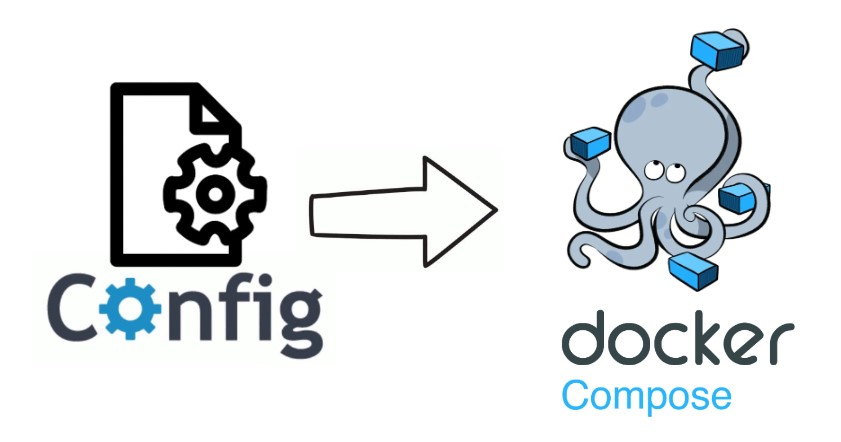
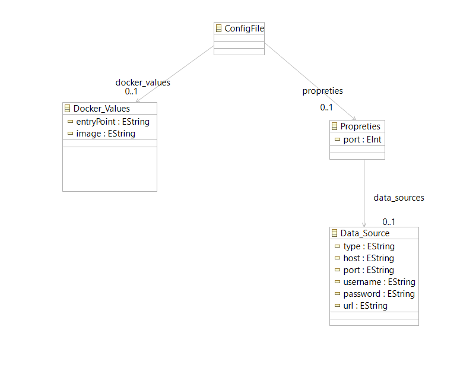
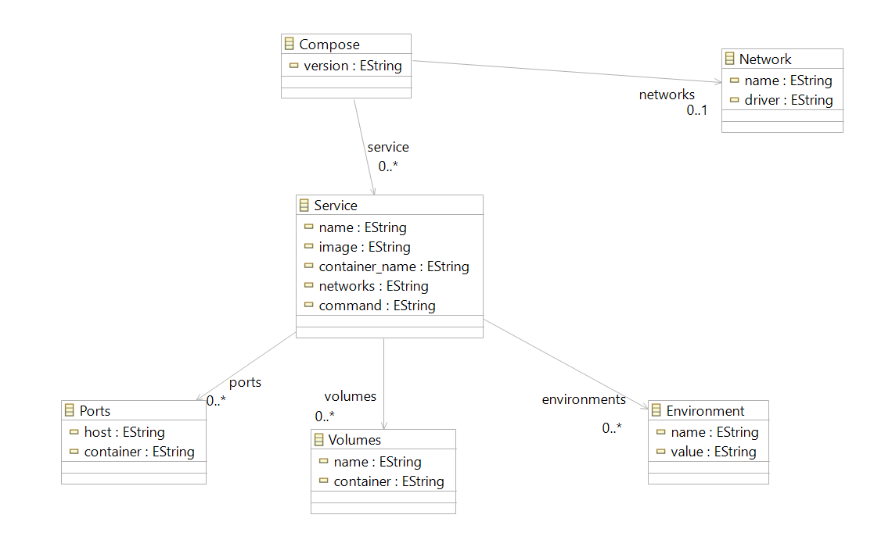

# Config2Compose

# Introduction

Welcome to Config2Compose; a Model-Driven Engineering approach to simplify the containerization & orchestration process for Spring Boot + database applications. 

# Problem

Tired of writing your docker compose files by hand? Tired of having to look up the docker compose file structure each time you have to write it? Fret not! For Config2Compose is here to simplify and avoid wasting time where it doesn't need to be!

# Our Solution

Config2Compose, a fairly easy to use web interface where the user can upload their maven config files (application.properties + dockerfiles), and the system; a model-driven approach, transforms these files into their corresponding Docker compose file to simplify the orchestration process. \(^o^)/**

# Architecture of our Solution

Our solution is a single-page web application developed using the java language with the spring boot framework and simple HTML and CSS for the front-end.

# Metamodels
## Configuration File Metamodel

## Docker compose Metamodel

