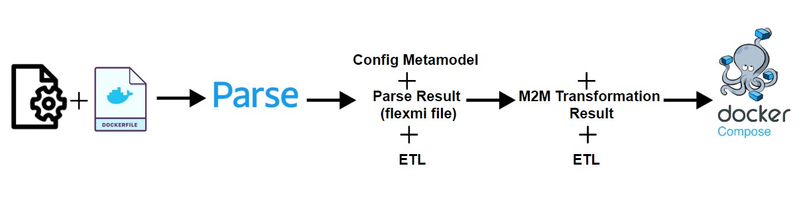

# Config2Compose


# Introduction

Welcome to Config2Compose; a Model-Driven Engineering approach to simplify the containerization & orchestration process for Spring Boot + database applications. 

# Problem

Tired of writing your docker compose files by hand? Tired of having to look up the docker compose file structure each time you have to write it? Fret not! For Config2Compose is here to simplify and avoid wasting time where it doesn't need to be!

# Our Solution

Config2Compose, a fairly easy to use web interface where the user can upload their maven config files (application.properties + dockerfiles), and the system; a model-driven approach, transforms these files into their corresponding Docker compose file to simplify the orchestration process. \(^o^)/**

# Architecture of our Solution

The application architecture revolves around a user-friendly single-page web interface and a robust backend built with Java and the Spring Boot framework. The front-end, developed using HTML and CSS, offers a seamless experience for users to upload their Maven configuration files, including application.properties and Dockerfiles. On the backend, a Spring Boot application manages user requests and file uploads, employing a model-driven approach to intelligently transform Maven configuration files into corresponding Docker Compose files.




# Metamodels
## 🎆Configuration File Metamodel


## 🎆Docker compose Metamodel


# Transformation
In order to achieve our desired outcomes using the model-driven approach, we need to make configure the Model-to-Model and Model-to-Text transformations that will transfrom our metamodels from config files to Docker compose file.

## Model-to-Model Transformation

It is the transformation that occurs from the config file metamodel to the docker compose metamodel, done using ETL (Epsilon Transformation Language), it takes as input the metamodels, the ETL transformation rules and the config file model instance. 

The ETL input is the flexmi file that is generated by the backend code after parsing and getting the relevant info from the application.properties and Dockerfiles:

```?nsuri: maven

configFile:
  Docker_values:
    entrypoint: "['java','-jar','/app.jar']"
    image_backend: "openjdk:17-jdk-alpine"
    image_db: "mysql:8.0"
  Properties:
    port: 8080
    Datasource:
      type: "mysql"
      url: "jdbc:mysql://database-1.c5xwkykn22e5.eu-north-1.rds.amazonaws.com:3306/readme"
      port: "3306"
      database: "db"
      username: "user"
      password: "pwd#"
```

Using Epsilon Playground, we got the following Target Model:


## Model-to-Text Transformation

The transformation that takes us from the compose metamodel to the Docker compose file in text format. It was done using EGL (Epsilon Generation Language).

It takes as input the target model generated from the ETL transfomration as a flexmi file:

```code
```

Its output is the final Docker compose file as shown below:


## Conclusion
In summary, this application seamlessly integrates an easy-to-use web interface with a robust backend, providing users with an easy solution to generate Docker Compose files from Maven configuration files.
This application utilizes a model-driven engineering (MDE) process that includes the creation of a Compose metamodel and a configuration file metamodel, and utilizes Epsilon for model-to-model and model-to-text translation.
The application automates the generation of the docker-compose.yml file.
This approach, based on MDE principles, ensures efficiency, accuracy, and adaptability in orchestrating  Docker environments based on user-provided Maven configurations and Docker files.


